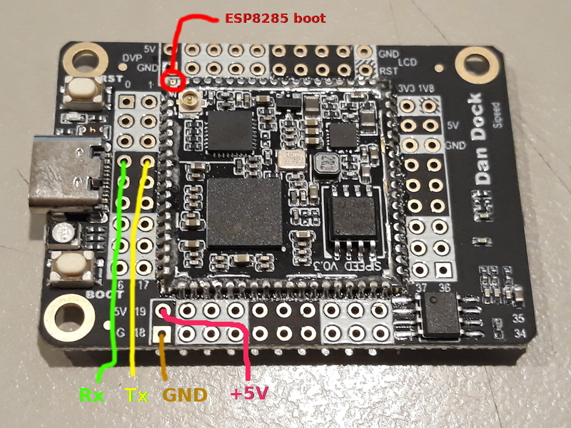

# ESP8266 AT FIRMWARE


[For more datailes see the sources repository](https://github.com/loboris/ESP8266_AT_LoBo)


## Main features:

* Built with the latest ESP8266 NON_OS SDK (v. 3.1)
* Can be installed on all ESP8266 supported SPI Flash sizes
* OTA update from any server, with MD5 checksum support, SSL support, version check, ...
  * Auto firmware partition select or forced update to any available partition
  * OTA **Bootloader** update is also supported
* Load any available firmware version, not only the latest, is supported
* Uses my own 2nd stage bootloader (full source available) for some special features
* New AT commands added
* Improved SSL/TLS support, up to 16384 bytes SSL buffer can be used enabling more SSL functionality
* Added support for loading CA certificate to RAM buffer
* Added support for loading the firmware from any location in SPI Flash, even above 2MB

## Supported SPI Flash sizes:

* 1MB 512+512 map, 2 OTA partitions
* 2MB 512+512 map, up to 4 OTA partitions
* 4MB 512+512 map, up to 8 OTA partitions
* 2MB 1024+1025 map, 2 OTA partitions
* 4MB 1024+1025 map, up to 4 OTA partitions
* 512K single firmware, no OTA available.

Larger Flash sizes can also be used.


## Flashing

You must have **esptool.py** installed on your system.<br>
The latest stable _esptool.py_ release can be installed from _pypi_ via pip:

```
pip install esptool
```

The **initial firmware** must be **flashed** to the ESP8266/ESP8285.<br>
Bash script `flash.sh` is provided to make the flashing as easy as possible.<br>
The correct `flash.sh` options must be specified, depending on the Flash type used:<br>
Change the working directory to `this directory` and run `flash.sh`:<br>
The default comm port is `/dev/ttyUSB0`, you can use a different com port by adding the option `--port <your_comm_port>`<br>


Flash to ESP8285, 1MB, 512+512 map, in dout mode:
```
./flash.sh -t 1MB -m DOUT
```
Flash to ESP8266, 1MB, 512+512 map, in qio mode:
```
./flash.sh -t 1MB
```
Flash to ESP8266, 2MB, 512+512 map, in qio mode:
```
./flash.sh -t 2MB
```
Flash to ESP8266, 4MB, 512+512 map, in qio mode:
```
./flash.sh -t 4MB
```
Flash to ESP8266, 2MB, 1024+1024 map, in qio mode:
```
./flash.sh -t 2MB-c1
```
Flash to ESP8266, 4MB, 1024+1024 map, in qio mode:
```
./flash.sh -t 4MB-c1
```
Flash to ESP8266, 512KB, single firmware, no OTA:
```
./flash.sh -t 512KB
```

---

## Flashing AT Firmware to the Sipeed-M1 (DanDock) board's WiFi (ESP8285)




1. Connect some _USBtoSerial_ adapter to the board, connect adapter's Tx to the Rx pin on the image, adapter's Rx to the Tx pin on the image. Be sure to also connect a ground to your adapter.
Note: Be careful that your _USBtoSerial_ adapter is labeled correctly. Some are not.
2. Connect the **ESP8285 boot** pin (the M1 module's corner pin near the WiFi antenna) to the ground before powering the the board, after power on, the pin can be released
3. Power on the board (connect USB cable to the board's USB-C connector)
4. Execute `./flash.sh -eo -t 1MB -m DOUT` to erase the existing firmware
5. Power off the board (disconnect USB cable from the board's USB-C connector)
6. Connect the **ESP8285 boot** pin to the ground before powering the the board, after power on, the pin can be released
7. Power on the board (connect USB cable to the board's USB-C connector)
8. Execute `./flash.sh -t 1MB -m DOUT -ne` to flash the new firmware
9. Power off the board

After booting to MicroPython, test the WiFi functionality:

```python
import network

wifi = network.wifi
wifi.debug(True)
wifi.start(tx=7, rx=6, ssid="<your_ssid>", password="<your_password>", wait=True)

```
